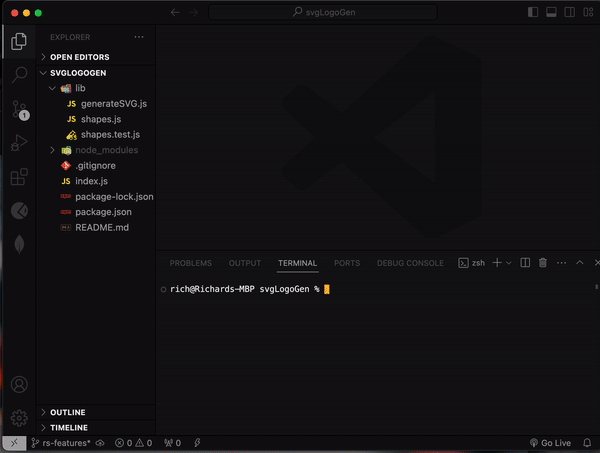

### SVG Logo Generator

## Features
Generate logos with the following shapes: Circle, Square, and Triangle.

## Usage
Node.js required on your machine

## Installation
Clone the following repository
Navigate to the file's directory
Install dependencies with 'npm i'

## Creating a Logo
On your Terminal or Gitbash, input "node index.js"
After completion of the following prompts, a logo under 'logo.svg' will be generated. You will now be able to view your newly created logo on a SVG compatible viewer!

## Testing
On your Terminal or Gitbash, run 'npm test'

## Contribution
Richard Song - www.richardsong.dev

## Link to GitHub Repository
https://github.com/song-richard/svgLogoGen

## License
This project is licensed under the MIT License.